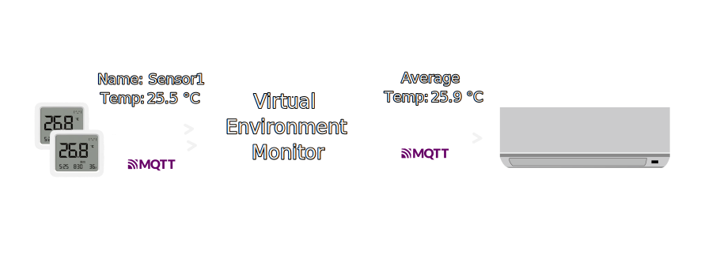
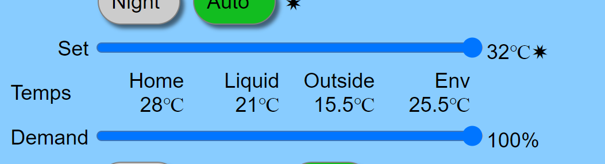

# MQTT Environment Monitor

## About project



The virtiaul environment monitor listens for multiple temperature sensors and sends average temperature to [ESP32-faikin](https://faikin.revk.uk) controller.

## Setup

### Manual

Prerequisites:

- [bun](https://bun.sh)

Steps:

1. Clone this repository.
2. `bun install`
3. Copy `.env.example` to `.env` and fill correct values.
4. `bun run src/index.ts`

### Docker

Steps:

1. Copy `.env.example` to `.env` and fill correct values.
2. Run docker command:

```sh
$ docker run --env-file .env ghcr.io/martynaszilinskas/mqtt-environment-monitor:latest
```

### Configuration

These are environment variables that must be set to start the service.

- **MQTT_URL** - MQTT Endpoint (Example: `mqtt://mqtt.example.com:1883`)
- **MQTT_USERNAME**
- **MQTT_PASSWORD**
- **TEMPERATURE_SENSOR_TOPICS** - Topics that hold numeric state and separated by comma (Example: `esphome/living-room/sensor/temperature/state,esphome/living-room2/sensor/temperature/state`)
- **FAIKIN_AC_TOPIC** - Faikin device base topic. Service will append `/control` path (Example: `Faikin/faikin-ac`)

## Usage

After setting up and running the project, the service will start listening to the specified MQTT topics for temperature data and send control command to faikin.



## Known Issues

- One instance can control only one Faikin.

## License

This project is licensed under [MIT License](./LICENSE).
