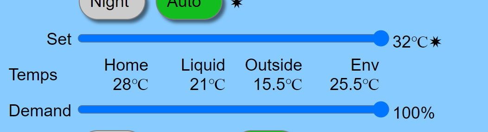

# MQTT Environment Monitor

## About project


The virtual environment monitor listens for multiple temperature sensors and
sends each configured sensor group's average temperature to its
[ESP32-faikout](https://faikout.revk.uk) controller.

## Setup

### Manual

Prerequisites:

- [bun](https://bun.sh)

Steps:

1. Clone this repository.
2. `bun install`
3. Copy `config.example.json` to `config.json` and configure the MQTT broker and
   AC units.
4. `bun run src/index.ts`

### Docker

Steps:

1. Copy `config.example.json` to `config.json` and update it.
2. Run the container with the configuration mounted read-only:

```sh
docker run \
  --mount type=bind,src="$(pwd)/config.json",dst=/config/config.json,readonly \
  --env CONFIG_PATH=/config/config.json \
  ghcr.io/martynaszilinskas/mqtt-environment-monitor:latest
```

### Configuration

Application settings are read from `config.json` and validated at startup. By
default the service reads `./config.json`. `CONFIG_PATH` can point to another
relative or absolute path.

```json
{
  "mqtt": {
    "url": "mqtt://mqtt.example.com:1883",
    "username": "thermostat",
    "password": "password"
  },
  "units": {
    "living-room": {
      "sensorTopics": [
        "esphome/living-room/sensor/temperature/state",
        "esphome/hall/sensor/temperature/state"
      ],
      "acTopic": "Faikout/living-room/control"
    }
  }
}
```

- `mqtt.url` is the shared MQTT endpoint.
- `mqtt.username` and `mqtt.password` must either both be non-empty strings or
  both be `null`/omitted for an anonymous connection.
- The `mqtt` object may be omitted when MQTT settings are supplied through the
  environment.
- `units` is a non-empty dictionary. Its key identifies the AC unit in logs.
- `sensorTopics` is a non-empty list of MQTT topics containing numeric
  temperature readings.
- `acTopic` is the complete MQTT topic used to send Faikout control commands.

Per-unit log lines include `unitId=<units key>`.

MQTT settings can instead be supplied using `MQTT_URL`, `MQTT_USERNAME`, and
`MQTT_PASSWORD`. When `MQTT_URL` is set, the environment settings replace the
entire `mqtt` object; file and environment values are never mixed. Set both
`MQTT_USERNAME` and `MQTT_PASSWORD` for authentication, or omit both for an
anonymous connection. If `MQTT_URL` is not set, the configuration file must
contain the `mqtt` object.

## Usage

After startup, the service listens to each unit's sensor topics and sends its
average temperature to that unit's Faikout command topic. An additional `Env`
column should appear in each Faikout dashboard.



## License

This project is licensed under [MIT License](./LICENSE).
